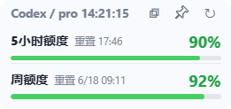

# Codex 额度监控

一个轻量的 Windows 托盘小工具，用来查看 Codex 账号剩余额度。

当前版本：`2.0.0`

## 特点

- 体积小，便携版单文件约 5 MB。
- 不需要安装，双击 EXE 即可运行。
- UI 简单，只显示关键额度信息。
- 常驻系统托盘，日常占用和打扰都很低。
- 支持小窗常驻，也可以切换到大窗查看完整信息。
- 直接调用本机 Codex app-server 读取额度，不依赖打开 Codex 桌面窗口。

## 下载和运行

在仓库根目录或 GitHub Releases 下载：

```text
Codex Quota Monitor 2.0.0 Portable.exe
```

双击运行即可。

使用前需要：

- Windows 10 / Windows 11
- 已安装并登录 Codex
- WebView2 Runtime，多数 Windows 10/11 已自带

## 使用方式

运行后会出现在系统托盘。

左键点击托盘图标可以显示或隐藏窗口。右键托盘图标可以打开菜单，支持切换小窗/大窗、置顶、开机自启动、立即刷新和退出。

小窗适合日常挂在桌面上：

```text
Codex: 5小时 88% / 周 98%
```

大窗会显示刷新时间、重置时间和两条进度条。额度颜色规则：

- `0% - 20%`：红色
- `21% - 50%`：橙色
- `51% - 100%`：绿色

工具每 10 秒自动刷新一次，也可以手动刷新。

## 界面预览

大窗模式：



小窗模式：


## 常见问题

### 关闭 Codex 后还能刷新吗？

可以。工具读取额度时会直接调用本机的 `codex.exe app-server`，不依赖已经打开的 Codex 桌面窗口。

只要 Codex 已安装、账号登录状态有效、网络可用，即使没有手动打开 Codex 窗口，也可以读取额度。

### 打开后没有额度怎么办？

先确认 Codex 已安装并登录。如果 Codex 安装在非默认位置，可以设置环境变量：

```text
CODEX_QUOTA_CODEX_PATH
```

值填写 `codex.exe` 的完整路径。

### 窗口打不开或一闪而过怎么办？

优先检查系统是否安装 WebView2 Runtime。便携版不内置 WebView2。

### 开机自启动没有生效怎么办？

便携版记录的是当前 EXE 路径。如果移动过 EXE 文件，请在右键菜单中关闭开机自启动，再重新开启。

## 版本说明

### 2.0.0

第一个正式 V2 版本。

- 基于 Tauri 2 重构，便携版体积约 5 MB。
- 提供简洁小窗和完整大窗两种模式。
- 支持 5 小时额度和周额度显示。
- 支持自动刷新、手动刷新、置顶、窗口位置记忆、开机自启动。
- 托盘图标用上下两条状态条展示两类额度。
- 增加后端额度缓存，减少大小窗切换时的数据不一致。

## 开发者说明

本仓库只发布 V2 版本源码。普通用户推荐直接下载 Releases 中的便携版 EXE；开发者可以基于源码自行启动开发版或重新打包。
