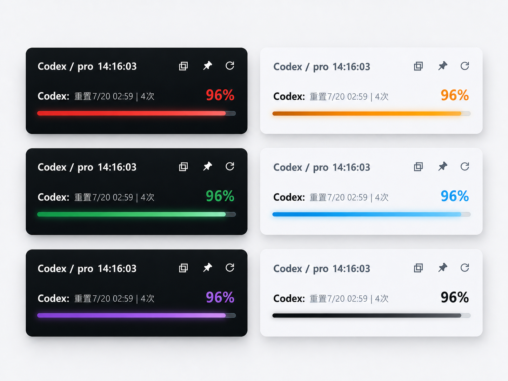
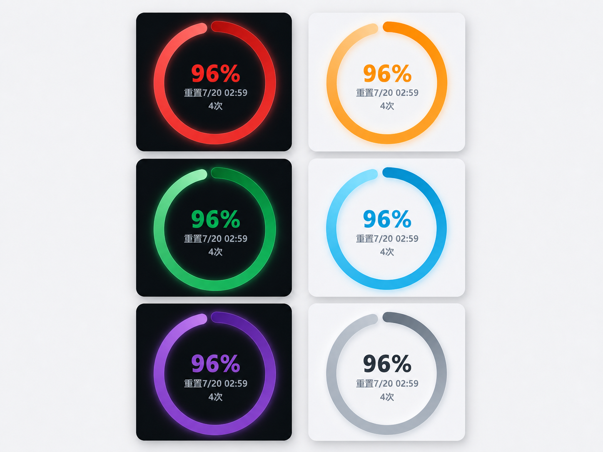
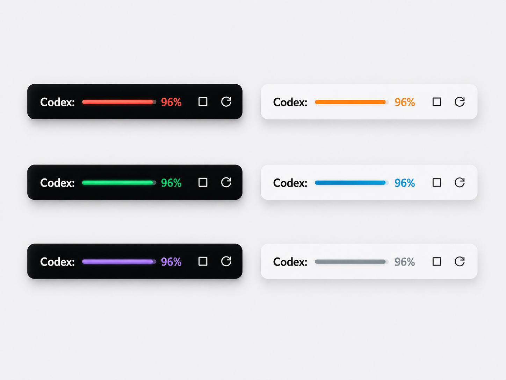

# Codex 额度监控

一个轻量的 Windows 托盘小工具，用来查看 Codex 账号剩余额度。

当前版本：`2.6.3`

Codex Skill 使用提示词：

```text
安装 https://github.com/DonaldL81/codex-quota/tree/main/skills/codex-quota-skill
```

默认会安装到当前用户程序目录，并启动最新版。

## 界面预览

进度大窗：



环形大窗：



小窗模式：



## 特点

- 体积小，便携版单文件约 8 MB。
- UI 简单，只显示关键额度信息。
- 系统占用低，适合长期放在托盘或桌面角落。
- 支持小窗、进度大窗和环形大窗三种样式。
- 支持自动检查更新，有新版本时托盘图标会显示提醒。
- 直接调用本机 Codex app-server 读取额度，不依赖打开 Codex 桌面窗口。

## 下载和运行

仓库根目录提供单文件版：

```text
单文件免安装包：
Codex Quota Monitor 2.6.3 Portable.exe
```

推荐普通用户使用最新的 `Portable.exe`，双击即可运行。首次运行后会自动固定到当前用户程序目录，并维护桌面快捷方式。

使用前需要：

- Windows 10 / Windows 11
- 已安装并登录 Codex
- WebView2 Runtime，多数 Windows 10/11 已自带

## 常见问题

### 关闭 Codex 后还能刷新吗？

可以。工具读取额度时会直接调用本机的 `codex.exe app-server`，不依赖已经打开的 Codex 桌面窗口。

只要 Codex 已安装、账号登录状态有效、网络可用，即使没有手动打开 Codex 窗口，也可以读取额度。

### 打开后没有额度怎么办？

先确认 Codex 已安装并登录。

2.0.1 已兼容 Codex 安装在如下两类路径：

```text
%LOCALAPPDATA%\OpenAI\Codex\bin\codex.exe
%LOCALAPPDATA%\OpenAI\Codex\bin\<版本或哈希目录>\codex.exe
```

如果 Codex 安装在其他位置，可以设置环境变量：

```text
CODEX_QUOTA_CODEX_PATH
```

值填写 `codex.exe` 的完整路径。

如果网络未连接、账号未登录或登录状态过期，窗口会显示“暂时无法获取”以及具体失败原因。短暂刷新失败但仍有上次额度时，会继续显示上次额度并提示刷新失败。处理后可以点击窗口刷新图标，或使用右键菜单中的“重启”重新启动工具。

### 窗口打不开或一闪而过怎么办？

优先检查系统是否安装 WebView2 Runtime。便携版不内置 WebView2。

### 开机自启动没有生效怎么办？

便携版记录的是当前 EXE 路径。如果移动过 EXE 文件，请在右键菜单中关闭开机自启动，再重新开启。

## 版本说明

### 2.6.3

- README 的界面预览替换为当前小窗、进度大窗和环形大窗三套宣传图，统一展示单周额度、深浅主题和九套配色的现行视觉语言。
- 本次仅更新宣传素材、版本号和发布说明，应用功能延续 `2.6.2`。

### 2.6.2

- 统一小窗、进度大窗和环形大窗的配色令牌，全部主题色与警告状态现在共用同一套渐变方向、轨道、文字和发光强度。
- 优化浅色面板的冷白哑光质感，收紧进度条与圆环的光晕范围，保留发光辨识度并减少泛白和廉价塑料感。
- 重新校准红、橙、黄、绿、青、蓝、紫、黑、白九套配色；黑白主题会根据深浅模式自动调整对比度。

### 2.6.1

- 修复窗口模式和两种大窗尺寸在切换或重启后发生变化的问题，进度大窗与环形大窗现在独立、稳定地记忆尺寸。
- 软件启动和模式切换后默认隐藏大窗控制栏与小窗按钮，鼠标移入内容区域后再显示。
- 修复环形大窗切换到小窗时按钮短暂闪现的问题。
- 环形窗口宽度不超过 `120px` 时仅显示重置日期，宽度增加后自动显示完整日期和时间。

### 2.6.0

- 修复环形窗失去焦点后四个圆角出现白色块的问题，使透明圆角合成与进度大窗一致。
- 原生窗口保留 DWM 圆角所需的 caption，只移除系统菜单和最小化/最大化按钮；`100×100` 至 `300×300` 的原生缩放和尺寸记忆保持不变。

### 2.5.8

- 旧环形窗尺寸记录统一一次性恢复为默认 `100×100`，清除多轮尺寸单位迁移遗留的异常矩形状态。
- 升级到新尺寸格式后，环形窗继续使用原生缩放，并独立记忆用户后续调整的宽高。
- 修复高 DPI 下 Windows 不可见标题栏把原生最小宽度抬高到约 `131` 逻辑像素的问题；保留系统缩放边框，`100×100` 现在是可实际达到的最小尺寸。

### 2.5.7

- 修复环形大窗尺寸记忆误把 Windows 外框高度保存为内容区高度的问题，窗口缩放或重启后不会再额外增高。
- 窗口贴边定位改用实际外框尺寸，避免带无标题缩放边缘的环形窗口在屏幕底部被截断。

### 2.5.6

- 修复高 DPI 显示器下环形大窗将物理像素与 WebView 逻辑尺寸混用的问题。`100×100` 现在与进度大窗使用同一套逻辑尺寸，圆环、文字和发光不会再被窗口边缘裁切。
- 旧版环形窗口尺寸会按显示器缩放比例迁移到新格式，继续保留用户已调整的视觉尺寸；尺寸范围仍为 `100×100` 到 `300×300`。

### 2.5.5

- 移除环形窗额外叠加的 Win32 缩放转交层。该层未改变系统最小尺寸，却会与 Tauri 的无标题窗口内部缩放协议竞争，造成拖拽跳到异常矩形尺寸。
- 环形窗恢复为与进度大窗一致的 Tauri 原生缩放链路：独立窗口创建时启用原生缩放，不使用前端热区，也不在缩放期间改写尺寸。
- 环形窗尺寸记录迁移为新格式，清除异常矩形记录并恢复默认 `100×100`。

### 2.5.4

- 环形窗扩展边缘的转交参数改为与 Tauri 无标题缩放实现完全一致的 `POINTS` 结构格式，父窗口可进入其内置的原生缩放分支。
- 保持 12px 原生边缘命中区，尺寸仍由 Tauri/Windows 处理，不引入前端热区或拖拽后修正。
- 环形窗尺寸记录迁移为新格式，移除此前验证产生的异常矩形尺寸，恢复默认 `100×100`。

### 2.5.3

- 环形窗扩展边缘的原生转交改为 Windows 标准 `WM_SYSCOMMAND + SC_SIZE`，取代在无标题子窗口中不稳定的非客户区按下消息。
- 边缘按下后由 Windows 立即接管鼠标捕获、窗口缩放和 `100×100` 至 `300×300` 的尺寸限制；不依赖前端热区、异步队列或拖拽后的尺寸修正。
- 环形窗尺寸记录迁移为新格式，移除此前验证产生的异常矩形尺寸，恢复默认 `100×100`。

### 2.5.2

- 修正子窗口缩放转交的时机：将异步消息改为同步 Windows 原生消息，确保父窗口在鼠标仍按下时立刻进入系统缩放循环。
- 解决扩展边缘拖拽时“放大跳变、向内缩小不生效”的问题；不改变前端布局，也不手动计算窗口尺寸。
- 环形窗尺寸记录再次迁移，移除此前验证产生的异常矩形尺寸，恢复默认 `100×100`。

### 2.5.1

- 修正环形窗的 12px 原生缩放区域只命中但未进入缩放的问题：Tauri 的无标题缩放遮罩是子窗口，扩展区域会收到普通左键消息。
- Windows 原生层现将该左键按下转交为系统 `WM_NCLBUTTONDOWN`，随后由 Windows 负责完整的缩放过程和最小/最大尺寸限制。
- 环形窗尺寸记录再次迁移，移除此前调试产生的异常尺寸，恢复默认 `100×100`。

### 2.5.0

- 已定位环形窗缩放停在 `170×100` 的根因：Tauri 的无标题窗口默认只提供约 4px 宽的原生缩放边缘，边缘之外会落入网页内容区，导致拖拽过程被打断并记忆中间尺寸。
- 环形窗保留系统原生缩放，额外在 Win32 原生层将该命中区域扩展为 12px；不使用前端透明热区，也不在缩放事件中改写窗口宽高。
- 环形窗尺寸记录迁移为新格式，安装后会清除旧的异常环形尺寸并恢复 `100×100` 默认值；之后仍独立记忆 `100×100` 到 `300×300` 范围内的宽高。

### 2.4.9

- 环形大窗改为独立的原生窗口，创建时即启用缩放，不再与小窗和进度大窗动态复用同一个窗口。
- 环形大窗移除前端缩放热区，完全使用系统窗口边框缩放；默认和最小尺寸保持 `100×100`，最大尺寸保持 `300×300`。
- 环形大窗尺寸记忆升级为独立窗口格式，旧的异常尺寸记录会恢复为默认尺寸。

### 2.4.0

- 进度大窗默认和最小尺寸改为 `200×50`。
- 增加环形大窗样式，窗口内三态按钮可在小窗、进度大窗和环形大窗之间切换。
- 右键菜单将大窗拆分为“打开进度大窗”和“打开环形大窗”。
- 环形大窗默认和最小尺寸为 `100×100`，最大尺寸为 `300×300`；窗口不强制正方形，圆环在内部按短边保持正圆居中。
- 环形大窗改用 SVG 圆环绘制，降低锯齿，圆环宽度和内部文字会随窗口尺寸缩放。
- 小窗鼠标移出后收起右侧操作按钮，并缩短窗口宽度；鼠标移入展开按钮时，原有进度条和百分比位置保持不变。

### 2.3.9

- 适配 Codex 不再显示 5 小时额度的现状，界面改为单周额度。
- 小窗改为 `Codex: [进度条] 百分比`。
- 大窗改为单行重置时间、可用重置次数和百分比；鼠标移出大窗时隐藏标题栏。
- 修复字段迁移后小窗可能短暂停在“正在读取”的问题。

### 2.3.8

- 兼容 Codex 只返回周额度的新格式，不再因此显示上次额度。
- 小窗会显示可用重置次数。

### 2.3.7

- 修复额度重置到满额附近时可能被误判为刷新失败的问题。

### 2.3.6

- 连续双击桌面快捷方式时只保留一个程序实例，并会唤起已运行窗口。

### 2.3.5

- 检查到新版本后会自动开始更新，不再需要再次点击版本菜单。
- 重启后发现新版本时，也会自动进入非阻塞更新流程。

### 2.3.4

- 自动刷新短暂失败时会先重试，减少误报刷新失败。
- 刷新失败但仍有上次额度时，提示改为“刷新失败，当前显示上次额度”。
- 重启后会保持上次的小窗或大窗状态。
- 修复更新下载文案百分比可能停在 0% 的问题。

### 2.3.3

- 优化真实透明度下的背景稳定性。
- 减少浏览器窗口拖动、贴边最大化或分屏时背景忽浅忽深的问题。

### 2.3.2

- 更新弹窗支持隐藏，隐藏后仍可在底部查看更新状态。
- 更新失败不会影响继续查看额度。
- 优化更新失败时的旧版本兜底启动。

### 2.3.1

- 修复应用内更新下载完成后未正确替换并重启的问题。
- 更新进度文案改为单行显示，百分比更直观。
- 优化右键菜单中的版本更新提示文案。

### 2.3.0

- 修复额度偶发同时显示为 100% 的问题。
- 优化透明度显示稳定性，减少背景忽浅忽深。
- 调整后续版本号规则，版本号后两段保持个位数字。

### 2.2.9

- 停止维护安装版，只保留单文件版。
- 优化单文件版更新体验，下载完成后会自动更新并重启。
- 首次运行或升级后会自动维护稳定入口和桌面快捷方式。
- 更新中会使用全窗口进度层，不再露出底层额度内容。

### 2.2.8

- 优化便携版更新体验，更新后会使用稳定程序入口并自动重启。
- 桌面快捷方式会指向稳定程序入口，后续更新不再依赖旧版本文件名。
- 有新版本时，右键菜单会显示“当前版本 » 最新版本”。
- 修复更新完成后打开所在文件夹失败的问题。

### 2.2.7

- 修复偶发额度显示为 100% 的问题。
- Codex 返回临时不完整额度数据时，会保留上一次有效额度并提示暂时无法获取。

### 2.2.6

- 启动后会在后台自动检查新版本，不影响窗口正常展示。
- 有新版本时，托盘图标会显示小红点提醒。
- 右键菜单版本号会显示“最新”或“更新到最新版本”，点击版本号可重新检查更新。
- 增加透明度设置，支持从 100% 到 0% 按 10% 调整。
- 右键菜单使用分隔线重新分组，常用功能更容易找到。

### 2.2.3

- 大窗进度条和百分比数字改为发光样式。
- 增加配色选择和深色模式。
- 刷新失败时保留上次额度，并显示失败原因。
- 自动刷新间隔改为更常用的预设选项。

### 2.2.2

- 优化大窗右上角图标大小，视觉更统一。

### 2.2.1

- 额度无法获取时显示更明确的失败原因。
- 增加“重启”菜单。
- 支持单击弹窗主体隐藏窗口。
- 优化大窗信息布局。

### 2.2

- 优化小窗和大窗的数据一致性。
- 减少刷新异常时卡在“正在读取”的情况。

### 2.1

- 支持双击弹窗主体隐藏窗口。
- 右键菜单增加版本号展示。

### 2.0.2

- 优化小窗启动和切换体验。
- 提供便携版和正式安装包。

### 2.0.1

- 提升 Codex 安装路径兼容性。
- 新增正式安装包。

### 2.0.0

第一个正式 V2 版本。

- 基于轻量桌面框架重构，便携版体积约 5 MB。
- 提供简洁小窗和完整大窗两种模式。
- 支持 5 小时额度和周额度显示。
- 支持自动刷新、手动刷新、置顶、窗口位置记忆、开机自启动。
- 托盘图标用上下两条状态条展示两类额度。
- 增加后端额度缓存，减少大小窗切换时的数据不一致。

## 开发者说明

本仓库只发布 V2 版本源码。普通用户推荐直接下载 Releases 中的便携版 EXE；开发者可以基于源码自行启动开发版或重新打包。

## Codex Skill

本仓库包含一个用于下载并运行最新版的 Codex skill：

```text
https://github.com/DonaldL81/codex-quota/tree/main/skills/codex-quota-skill
```
