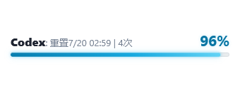
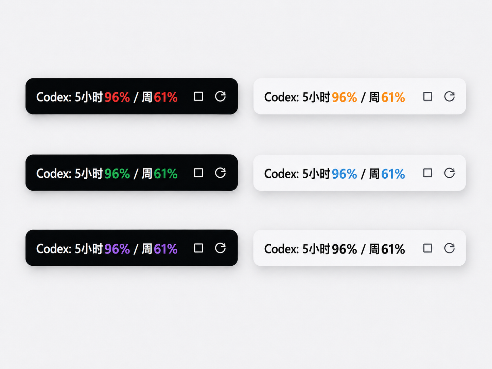

# Codex 额度监控

一个轻量的 Windows 托盘小工具，用来查看 Codex 账号剩余额度。

当前版本：`2.3.1`

Codex Skill 使用提示词：

```text
安装 https://github.com/DonaldL81/codex-quota/tree/main/skills/codex-quota-skill
```

默认会安装到当前用户程序目录，并启动最新版。

## 界面预览

大窗模式：



小窗模式：



## 特点

- 体积小，便携版单文件约 8 MB。
- UI 简单，只显示关键额度信息。
- 系统占用低，适合长期放在托盘或桌面角落。
- 支持小窗常驻，也可以切换到大窗查看完整信息。
- 支持自动检查更新，有新版本时托盘图标会显示提醒。
- 直接调用本机 Codex app-server 读取额度，不依赖打开 Codex 桌面窗口。

## 下载和运行

仓库根目录提供单文件版：

```text
单文件免安装包：
Codex Quota Monitor 2.3.1 Portable.exe
```

推荐普通用户使用最新的 `Portable.exe`，双击即可运行。首次运行后会自动固定到当前用户程序目录，并维护桌面快捷方式。

使用前需要：

- Windows 10 / Windows 11
- 已安装并登录 Codex
- WebView2 Runtime，多数 Windows 10/11 已自带

## 常见问题

### 关闭 Codex 后还能刷新吗？

可以。工具读取额度时会直接调用本机的 `codex.exe app-server`，不依赖已经打开的 Codex 桌面窗口。

只要 Codex 已安装、账号登录状态有效、网络可用，即使没有手动打开 Codex 窗口，也可以读取额度。

### 打开后没有额度怎么办？

先确认 Codex 已安装并登录。

2.0.1 已兼容 Codex 安装在如下两类路径：

```text
%LOCALAPPDATA%\OpenAI\Codex\bin\codex.exe
%LOCALAPPDATA%\OpenAI\Codex\bin\<版本或哈希目录>\codex.exe
```

如果 Codex 安装在其他位置，可以设置环境变量：

```text
CODEX_QUOTA_CODEX_PATH
```

值填写 `codex.exe` 的完整路径。

如果网络未连接、账号未登录或登录状态过期，窗口会显示“暂时无法获取”以及具体失败原因。处理后可以点击窗口刷新图标，或使用右键菜单中的“重启”重新启动工具。

### 窗口打不开或一闪而过怎么办？

优先检查系统是否安装 WebView2 Runtime。便携版不内置 WebView2。

### 开机自启动没有生效怎么办？

便携版记录的是当前 EXE 路径。如果移动过 EXE 文件，请在右键菜单中关闭开机自启动，再重新开启。

## 版本说明

### 2.3.1

- 修复应用内更新下载完成后未正确替换并重启的问题。
- 更新进度文案改为单行显示，百分比更直观。
- 优化右键菜单中的版本更新提示文案。

### 2.3.0

- 修复额度偶发同时显示为 100% 的问题。
- 优化透明度显示稳定性，减少背景忽浅忽深。
- 调整后续版本号规则，版本号后两段保持个位数字。

### 2.2.9

- 停止维护安装版，只保留单文件版。
- 优化单文件版更新体验，下载完成后会自动更新并重启。
- 首次运行或升级后会自动维护稳定入口和桌面快捷方式。
- 更新中会使用全窗口进度层，不再露出底层额度内容。

### 2.2.8

- 优化便携版更新体验，更新后会使用稳定程序入口并自动重启。
- 桌面快捷方式会指向稳定程序入口，后续更新不再依赖旧版本文件名。
- 有新版本时，右键菜单会显示“当前版本 » 最新版本”。
- 修复更新完成后打开所在文件夹失败的问题。

### 2.2.7

- 修复偶发额度显示为 100% 的问题。
- Codex 返回临时不完整额度数据时，会保留上一次有效额度并提示暂时无法获取。

### 2.2.6

- 启动后会在后台自动检查新版本，不影响窗口正常展示。
- 有新版本时，托盘图标会显示小红点提醒。
- 右键菜单版本号会显示“最新”或“更新到最新版本”，点击版本号可重新检查更新。
- 增加透明度设置，支持从 100% 到 10% 按 10% 调整。
- 右键菜单使用分隔线重新分组，常用功能更容易找到。

### 2.2.3

- 大窗进度条和百分比数字改为发光样式。
- 增加配色选择和深色模式。
- 刷新失败时保留上次额度，并显示失败原因。
- 自动刷新间隔改为更常用的预设选项。

### 2.2.2

- 优化大窗右上角图标大小，视觉更统一。

### 2.2.1

- 额度无法获取时显示更明确的失败原因。
- 增加“重启”菜单。
- 支持单击弹窗主体隐藏窗口。
- 优化大窗信息布局。

### 2.2

- 优化小窗和大窗的数据一致性。
- 减少刷新异常时卡在“正在读取”的情况。

### 2.1

- 支持双击弹窗主体隐藏窗口。
- 右键菜单增加版本号展示。

### 2.0.2

- 优化小窗启动和切换体验。
- 提供便携版和正式安装包。

### 2.0.1

- 提升 Codex 安装路径兼容性。
- 新增正式安装包。

### 2.0.0

第一个正式 V2 版本。

- 基于轻量桌面框架重构，便携版体积约 5 MB。
- 提供简洁小窗和完整大窗两种模式。
- 支持 5 小时额度和周额度显示。
- 支持自动刷新、手动刷新、置顶、窗口位置记忆、开机自启动。
- 托盘图标用上下两条状态条展示两类额度。
- 增加后端额度缓存，减少大小窗切换时的数据不一致。

## 开发者说明

本仓库只发布 V2 版本源码。普通用户推荐直接下载 Releases 中的便携版 EXE；开发者可以基于源码自行启动开发版或重新打包。

## Codex Skill

本仓库包含一个用于下载并运行最新版的 Codex skill：

```text
https://github.com/DonaldL81/codex-quota/tree/main/skills/codex-quota-skill
```
